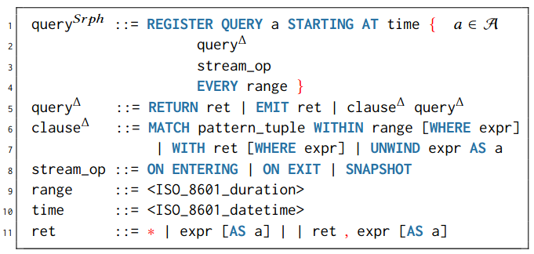

# Seraph query parser

An ANTLR4 parser for Seraph continuous graph queries.

This project is still under development.

## Syntax
The syntax of Seraph extends the syntax of Cypher 9 as follows:

 

## Usage example
**Example query**
```
REGISTER QUERY <query_name> STARTING AT 2019-09-07T15:50:30.022+01:00 {
MATCH (a) - [b] -> (c) WITHIN PT1H WHERE a = 1 OR b = 2
RETURN c
ON EXIT 
EVERY PT10M }
```

**Resulting CQ-Object**

&ensp; *id* = `<query_name>` \
&ensp; *starting_time* =  `2019-09-07T15:50:30.022+01:00` \
&ensp; match_clause: \
&ensp; &emsp; &emsp; *pattern* = `(a) - [b] -> (c)` \
&ensp; &emsp; &emsp; *range* = `PT1H` \
&ensp; &emsp; &emsp; *expression* = `a = 1 OR b = 2` \
&ensp; return_clause: \
&ensp; &emsp; &emsp; *expression* = `c` \
&ensp; *stream_operator* = `ON EXIT` \
&ensp; *range* = `PT10M`

**Using Java Methods**

Create ContinuousQuery:
``` 
ContinuousQuery myQuery = QueryFactory.parse(queryString);
```
Get ID of ContinuousQuery:
```
myQuery.getId();    // <query_name>
```
Get match clause of ContinuousQuery:
```
ArrayList<MatchClause> matchClauses = myQuery.getMatchClauses();
matchClauses.get(0).getPattern();           // (a) - [b] -> (c)
matchClauses.get(0).getDuration();          // PT1H
matchClauses.get(0).getWhereExpression();   // a = 1 OR b = 2
```

Further application examples can be found in the _Example_ class.


## License

Licensed under the [Apache License, Version 2.0](https://www.apache.org/licenses/LICENSE-2.0).
